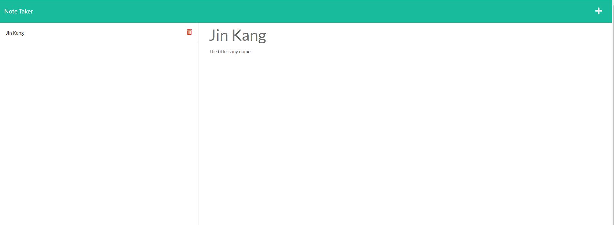

# NoteTaker

## Link to the deployed application
Heroku app link:
https://notetaker-kbjss071.herokuapp.com/

## To-do lists
- When an user opens the Note Taker,
    - the user should be presented with a landing page with a link to a notes page.
- When the user clicks on the link to the notes page,
    - the user should be presented with a page with exisitng notes listed in the left-hand column, and empty fields to enter a note title and the note's text in the right-hand column.
- When the user enters a new note title and the note's text,
    - then a Save icon appears in the navigation at the top of the page.
- When the user clicks on the Save icon,
    - then the new note I have entered is saved and appears in the left-hand column with the other existing notes.
- When the user clicks on an existing note in the list in the left-hand column,
    - then the note appears in the right-hand column.
- When the user clicks on the Write iconin the navigation at the top of the page,
    - then the user should be presented with empty fields to enter a new note title and the notes' text in the right-hand column.

## Words done for this project
- Created two HTML calls for `index.html` and `notes.html` in case certain urls are called
- Created GET, POST, and DELETE methods to get data from a database, send a data to the database, and delete a data from the database.
- Open a `Heroku` url to deploy the application.